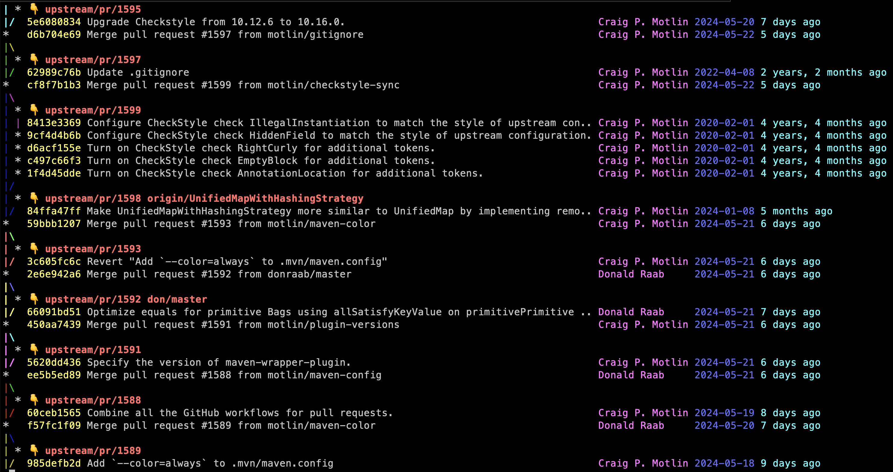

# Git Configuration

This post is about one-time git configuration; commands that start with `git config --global`.

These settings are a [subset of my configuration](https://github.com/motlin/dotfiles/blob/main/gitconfig) that I'm comfortable recommending for any user on any machine. I've gathered git configuration from [the git-scm book](https://git-scm.com/book/en/v2/Customizing-Git-Git-Configuration), the [GitHub Blog](https://github.blog/tag/git/), [Julia Evans](https://jvns.ca/blog/2024/02/16/popular-git-config-options/), and [Scott Chacon](https://blog.gitbutler.com/git-tips-and-tricks/).

Even after running these commands, you may still want to copy from my [.gitconfig](https://github.com/motlin/dotfiles/blob/main/gitconfig) since it includes comments.

## Aliases

### Shorthand aliases

The [git-scm book includes a few aliases](https://git-scm.com/book/en/v2/Git-Basics-Git-Aliases) that have become very common.

```shell
git config --global alias.co        checkout
git config --global alias.br        branch
git config --global alias.ci        commit
git config --global alias.st        status
git config --global alias.unstage   "reset HEAD --"
git config --global alias.last      "log -1 HEAD"
```

Here are a few of my own that seem to be pretty common.

```shell
git config --global alias.cp        cherry-pick
git config --global alias.oops      "commit --amend --no-edit"
```

And a few more of my own that aren't too common, but you might like.

```shell
git config --global alias.ri        "rebase --interactive --autosquash"
git config --global alias.f         "fetch --all --prune --jobs=16"
git config --global alias.detach    "checkout --detach"
```

### Plural aliases

`git` has inconsistent commands to list all [branches, tags, stashes](http://gggritso.com/human-git-aliases), workrees, remotes, and [aliases](https://stackoverflow.com/a/7067489/23572).

```shell
git config --global alias.branches  "branch --all"
git config --global alias.tags      "tag --list"
git config --global alias.stashes   "stash list"
git config --global alias.aliases   "config --get-regexp ^alias\."
git config --global alias.worktrees "worktree list"
git config --global alias.remotes   "remote --verbose"
git config --global alias.configs   "config --list --show-origin"
```

### StackOverflow aliases

Use `git root` to [get the root directory of the repository](https://stackoverflow.com/a/957978/).

Use `git first` to [get the initial commit(s) that are ancestors of HEAD](https://stackoverflow.com/a/1007545/).

```shell
git config --global alias.root      "rev-parse --show-toplevel"
git config --global alias.first     "rev-list --max-parents=0 HEAD"
```

`git push --force-with-lease` is [a safer alternative](https://git-scm.com/docs/git-push#Documentation/git-push.txt---no-force-with-lease) to `git push --force` that ensures that you've at least fetched/seen the history that you're about to wipe out.

There [is no way to configure git](https://stackoverflow.com/a/30567394/) to always use force-with-lease instead of force. The next best available option is to create an alias.

```shell
git config --global alias.pushf     "push --force-with-lease --force-if-includes"
```

### Log aliases

You can view a nice graph of your git history with `git log --decorate --graph --oneline`. You can get fancy with the `--format` option. These aliases all use the same format, but display different subsets of refs.

- `l` for specified branches or HEAD, as in `git l main`.
- `la` for almost all branches and refs, excluding refs/notes, refs/stash, dependabot stuff, and pull requests. 
- `laa` for truly all refs.
- `decorate` is like `la`, but with [`--simplify-by-decoration`](https://git-scm.com/docs/git-log#Documentation/git-log.txt---simplify-by-decoration).

```shell
git config --global alias.l         "log \
        --graph \
        --decorate \
        --date=short \
        --format=format:'%C(auto)%(decorate:prefix=👇 ,suffix=%n,tag=,separator= )%C(reset)%C(brightyellow)%h%C(reset) %C(normal)%<|(-50,trunc)%s%C(reset) %C(brightmagenta)%<(15,trunc)%an%C(reset) %C(brightblue)%ad%C(reset) %C(brightcyan)%ar%C(reset)'"

git config --global alias.laa       "l --all"

git config --global alias.la        "l \
        --exclude=refs/prefetch/* \
        --exclude=refs/remotes/origin/pr/* \
        --exclude=refs/remotes/upstream/pr/* \
        --exclude=refs/remotes/origin/dependabot/* \
        --exclude=refs/notes/tests/* \
        --exclude=refs/stash \
        --all"
        
git config --global alias.decorate  "la --simplify-by-decoration"
```

The common formatting options deserve explanation.

- `%C(auto)%(decorate:prefix=👇 ,suffix=%n,tag=,separator= )%C(reset)` ref names, like the `--decorate` option but on a separate line, like `* upstream/pr/123`.
- `%C(brightyellow)%h%C(reset)` abbreviated commit hash in bright yellow, like `63978b049`.
- `%C(normal)%<|(-50,trunc)%s%C(reset)` subject (commit message) truncated 50 characters away from the right edge of the screen.
- `%C(brightmagenta)%<(15,trunc)%an%C(reset)` author name truncated to 15, in bright magenta.
- `%C(brightblue)%ad%C(reset)` author date, in bright blue, like `2000-12-31`.
- `%C(brightcyan)%ar%C(reset)%` author date, relative, in bright cyan, like `10 days ago`.



## Fetch and Push

`git push` behavior varies based on the [push.default](https://git-scm.com/docs/git-config#Documentation/git-config.txt-pushdefault) setting. Possible values are `nothing`, `current`, `upstream`, `tracking`, `simple`, and `matching`. The default changed from `matching` to `simple` in Git 2.0.

I prefer `current` because it is intuitive. It pushes the current branch to a branch of the same name on the remote. If the remote branch doesn't exist, it creates one.

```shell
git config --global push.default current
```

## Diff

By default, `git` [detects copies but not renames](https://git-scm.com/docs/git-config#Documentation/git-config.txt-diffrenames). Turning on rename detection supposedly slows down `git diff` but I haven't noticed a difference.

`git diff` should use a [prefix pair that is different from the standard](https://git-scm.com/docs/git-config#Documentation/git-config.txt-diffmnemonicPrefix) "a/" and "b/" depending on what is being compared. This option is only relevant when not piping through a pager/formatter like diff-so-fancy.

```shell
git config --global diff.renames copies
git config --global diff.mnemonicPrefix true
```

## Branches

### Branch

Scott Chacon wrote a 3-part series called [Git Tips and Tricks](https://blog.gitbutler.com/git-tips-and-tricks/). A few tips cover global config.

> One thing that's always bugged me about Git is that I run git branch a lot to view what branches I have, but they're in the dumbest possible order (alphabetic) and there are a million of them after a while.

We can [configure git to sort](https://git-scm.com/docs/git-config#Documentation/git-config.txt-branchsort) by "negative committer date."

> Git also has a way to take a list of branches and try to split it into columns to make better use of the screen real estate. You can do this either with the new --column option, or with [the column.ui setting](https://git-scm.com/docs/git-config#Documentation/git-config.txt-columnui).

```shell
git config --global branch.sort -committerdate
git config --global column.ui auto
```

It is idiomatic to name the first/main branch `main`. It used to be idiomatic to name it `master` and and unconfigured `git init` call will still create a `master` branch and print this hint.

```shell
❯ git init
hint: Using 'master' as the name for the initial branch. This default branch name
hint: is subject to change. To configure the initial branch name to use in all
hint: of your new repositories, which will suppress this warning, call:
hint:
hint: 	git config --global init.defaultBranch <name>
hint:
hint: Names commonly chosen instead of 'master' are 'main', 'trunk' and
hint: 'development'. The just-created branch can be renamed via this command:
hint:
hint: 	git branch -m <name>
```

Configuring the default branch name suppresses this hint.

```shell
git config --global init.defaultBranch main
```

### Merge and rebase

`git` can auto-stash before a [merge](https://git-scm.com/docs/git-config#Documentation/git-config.txt-mergeautoStash) or [rebase](https://git-scm.com/docs/git-config#Documentation/git-config.txt-rebaseautoStash). This means that you can run merge or rebase in a dirty worktree.

`git` can [prevent merge commits](https://git-scm.com/docs/git-config#Documentation/git-config.txt-mergeff) by default.

`git` can [warn or error if commits are missing during an interactive rebase](https://git-scm.com/docs/git-config#Documentation/git-config.txt-rebasemissingCommitsCheck) to prevent accidental deletion of commits.

`git` can [automatically force-update any branches that point to commits that are being rebased](https://github.blog/2022-10-03-highlights-from-git-2-38/#rebase-dependent-branches-with-update-refs).

When a new branch is created with `git branch` or `git checkout` that tracks another branch, `git` should set up `pull` to [rebase instead of merge](https://git-scm.com/docs/git-config#Documentation/git-config.txt-branchautoSetupRebase).

`git` should set up new branches so that `git-pull` will [merge from the starting point branch](https://git-scm.com/docs/git-config#Documentation/git-config.txt-branchautoSetupMerge).

```shell
git config --global merge.autoStash true
git config --global rebase.autoStash true
git config --global rebase.missingCommitsCheck error
git config --global rebase.updateRefs true
git config --global branch.autoSetupRebase always
```

### Rerere

According to [the git-scm book](https://git-scm.com/book/en/v2/Git-Tools-Rerere):

> The git rerere functionality is a bit of a hidden feature. The name stands for "reuse recorded resolution" and, as the name implies, it allows you to ask Git to remember how you've resolved a hunk conflict so that the next time it sees the same conflict, Git can resolve it for you automatically.

This feature is off by default, but there's [no downside](https://stackoverflow.com/questions/5519244/are-there-any-downsides-to-enabling-git-rerere) to enabling it.

For convenience, [configure rerere to stage changes automatically](https://git-scm.com/docs/git-config#Documentation/git-config.txt-rerereautoUpdate). This skips the `git add` step and makes it clear when rerere has resolved a merge conflict, as `git status` will show no unstaged changes.

```shell
git config --global rerere.enabled true
git config --global rerere.autoUpdate true
```

## Log

`git log` has [a `--follow` option](https://git-scm.com/docs/git-log#Documentation/git-log.txt---follow) that continues listing the history of a file beyond renames. This option only works for a single file.

```shell
git log --follow -- <path>
```

We can [configure git](https://git-scm.com/docs/git-config#Documentation/git-config.txt-logfollow) to act as if the `--follow` option was used when a single `<path>` is given.

```shell
git config --global log.follow true
```

`git log` [has an option](https://git-scm.com/docs/git-log#Documentation/git-log.txt---decorateshortfullautono) `--decorate` that displays the ref names of any logged commits. `git` [can be configured](https://git-scm.com/docs/git-config#Documentation/git-config.txt-logdecorate) to always show these ref names.

If short is specified, the ref name prefixes `refs/heads/`, `refs/tags/` and `refs/remotes/` will not be printed. If full is specified, the full ref name (including prefix) will be printed.

```shell
git config --global log.decorate short
```

## Commit

The [docs for `git commit --verbose`](https://git-scm.com/docs/git-commit#Documentation/git-commit.txt---verbose) say:

> Show unified diff between the HEAD commit and what would be committed at the bottom of the commit message template to help the user describe the commit by reminding what changes the commit has.

This diff shows up in the same editor where you write the commit message, and can be helpful for auto-completing identifier names that appear in code.

We can set [commit.verbose](https://git-scm.com/docs/git-config#Documentation/git-config.txt-commitverbose) to always show this diff.

```shell
git config --global commit.verbose true
```

## Submodules

If you don't use submodule, you can skip this section.

[Diffs of submodules should show the changed contents](https://git-scm.com/docs/git-config#Documentation/git-config.txt-diffsubmodule) rather than a list of commits.

[git status should show a summary of commits](https://git-scm.com/docs/git-config#Documentation/git-config.txt-statussubmoduleSummary) for modified submodules.

```shell
git config --global diff.submodule diff
git config --global status.submoduleSummary true
```

## Include

After following the advice here, you'll have a `~/.gitconfig` file that you may want to share between machines. I keep mine in a [dotfiles repository](https://github.com/motlin/dotfiles) and sync it using [dotbot](https://github.com/anishathalye/dotbot). This setup requires splitting out machine-specific configuration into a separate file.

Git supports [including other configuration files](https://git-scm.com/docs/git-config#_includes) with the `include` directive.

```shell
git config --global include.path "~/.gitconfig.local"
```

I like to move the entire `user` section into `~/.gitconfig.local`.

```ini
❯ grep -F '[user]' ~/.gitconfig.local -A2
[user]
	name = Craig Motlin
	email = <email@email.com>
```

I follow [GitHub's advice](https://blog.github.com/2016-03-28-git-2-8-has-been-released/#dont-guess-my-identity) to set [`user.useConfigOnly`](https://git-scm.com/docs/git-config#Documentation/git-config.txt-useruseConfigOnly) to avoid git guessing my email address.

> if, say, you want Git to use one email address for your open source projects and a different one for your work projects, you’ve undoubtedly made the mistake of committing to a new Git repository without having first set your email address in that repository. In this situation, Git emits a warning, but it creates the commit anyway, using an email address that it guesses from the local system hostname. If you’re trying to do something as complicated as different addresses for different projects, this is almost certainly not what you want.

```shell
git config --global user.useConfigOnly true
```

## Performance

### Caching

In [Improve Git monorepo performance with a file system monitor](https://github.blog/2022-06-29-improve-git-monorepo-performance-with-a-file-system-monitor/), the GitHub blog recommends turning on the built-in [file system monitor](https://git-scm.com/docs/git-config#Documentation/git-config.txt-corefsmonitor) and [untracked cache](https://git-scm.com/docs/git-config#Documentation/git-config.txt-coreuntrackedCache) to speed up subsequent git commands like `git status` in a working directory with many files.

```shell
git config --global core.fsmonitor true
git config --global core.untrackedCache true
```

### Fast Merging

The [GitHub Blog](https://github.blog/2021-08-16-highlights-from-git-2-33/#merge-ort-a-new-merge-strategy) recommends using the `ort` merge strategy for merges over the default `recursive` strategy because it's 500x faster.

> The new merge-ort is likely to become the default strategy in a future version of Git.

In the meantime you can [configure it](https://git-scm.com/docs/git-config#Documentation/git-config.txt-pulltwohead) with:

```shell
git config --global pull.twohead ort
```

### Git Maintenance

The `git maintenance` command registers a repository for periodic background optimizations.

> Run tasks to optimize Git repository data, speeding up other Git commands and reducing storage requirements for the repository.
>
> Git commands that add repository data, such as  `git add`  or  `git fetch`, are optimized for a responsive user experience. These commands do not take time to optimize the Git data, since such optimizations scale with the full size of the repository while these user commands each perform a relatively small action.
>
> The  `git maintenance`  command provides flexibility for how to optimize the Git repository.

```shell
git maintenance start
```

The list of repositories is machine specific. After running `git maintenance`, move the list of repositories from `~/.gitconfig` to `~/.gitconfig.local`.

```ini
[maintenance]
    repo = ~/.dotfiles
```

## :icon-comment-discussion: Comments

[Leave a comment on medium](https://motlin.medium.com/git-config-3d20c4c079ba)
